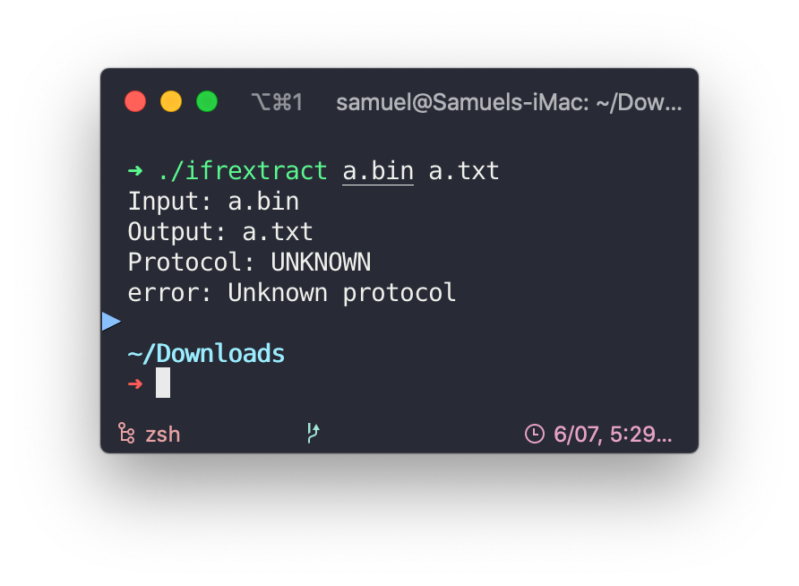

# Intel-i9-10900-Gigabyte-Z490-Vision-G-Hackintosh


Hello folks, I have successfully installed macOS 10.15.5(initial setup) on my PC.  

Tested working version:
 - macOS Catalina 10.15.5~10.15.6
 - macOS Big Sur Beta (Safari v14.0 No DRM)

## Bootloader

**[Opencore](https://github.com/acidanthera/OpenCorePkg) 0.6.1**

## Hardware

- Intel i9-10900 (Locked version)
- [Gigabyte Z490 Vision G](https://www.gigabyte.com/Motherboard/Z490-VISION-G-rev-1x):
  - Audio: Realtek ALC1220-V
  - 2.5Gb Ethernet: Intel I225-V
- RAM: 16GB * 2 Kingston 2666 MHz
- dGPU: [MSI Radeon™ RX 580 ARMOR 8G OC](https://www.msi.com/Graphics-card/Radeon-RX-580-ARMOR-8G-OC/)
- Wireless chip: Fenvi T919
- Display: ASUS MX27UC 4k Display
- SMBIOS: iMac19,1
- BIOS version: F6

## Benchmark

https://browser.geekbench.com/v5/cpu/2412288

## Working

- **Audio**: Realtek ALC1220-V (AppleALC.kext, layout-id=7, device-id=0xA170, FakeID.kext, FakePCIID_Intel_HDMI_Audio.kext)

- **USB**: All ports working, USB map is shown below

- **Ethernet**: Intel I225-V 2.5Gb

  1. Add device property:  

     ```xml
     <dict>
     	<key>PciRoot(0x0)/Pci(0x1C,0x1)/Pci(0x0, 0x0)</key>
     	<dict>
     		<key>device-id</key>
     		<data>8hUAAA==</data>
     	</dict>
     </dict>
     ```
     
  2. Create custom FakeID-kext "FakePCIID_Intel_I225-V.kext".

- **dGPU**: RX 580 8GB.  
  Works OOB, supports HiDPI in 4K display. DRM also works with `shikigva=80` in boot-args.

- **iGPU**: UHD 630 (headless mode + dGPU)  
  Using ```AAPL,ig-platform-id: 0300923E``` and everything works OOB.  
  Sidecar tested by [rjenny509](https://www.reddit.com/r/hackintosh/comments/h7nctk/first_hackintosh_was_a_success_i7_10700k_rx5700xt/fumlvl9/)

- **Bluetooth & Wi-Fi**: Fenvi T919  
  Works OOB. Bluetooth's internal USB port needs to be configured in custom UIAC.aml.

- Native NVRAM

- Sleep/Wake

- Reboot/Shutdown

## Not/Partially Working

- iGPU UHD-630

  1. Using only iGPU:
      ```
      AAPL,ig-platform-id: 07009B3E
      ```  

     - ~~Safari can't open www.fb.com~~  
     - ~~Firefox quit when opening~~  
     - ~~VMware Fusion display problem (VM quit when loading vmware tool's display driver)~~  
     - ~~Can't change account profile picture~~  
     - Problems above are fixed after removing frambuffer patch
     - iGPU HDMI output not working (Displayport is fine)
  
  2. Using iGPU + dGPU:   
    Doesn't show UHD 630 in SystemReport/Graphics    
    
      1. AAPL,ig-platform-id: 07009B3E  
    
          ```
          AAPL,ig-platform-id: 07009B3E
          ```
        - Long boot time (about 30~40 seconds)
        - iGPU HDMI output not working (Displayport is fine)
        - iGPU successfuly tested in Geekbench 5 (https://browser.geekbench.com/v5/compute/1021988)  
    


      2. AAPL,ig-platform-id: 0300923E (**Current setting**)

          ```AAPL,ig-platform-id: 0300923E```  
        Fully working.

- DRM

    DRM not working in Big Sur beta, Catalina works.


## USB Ports

See [USB-Port-Configuration.md](./USB-Port-Configuration.md)

## Audio

Needed:

- AppleALC.kext
- FakeID.kext
- FakePCIID_Intel_HDMI_Audio.kext
- layout-id=7
- device-id=0xA170

Layout-id and device-id is injected via the device properties.

```xml
<key>DeviceProperties</key>
	<dict>
		<key>Add</key>
		<dict>
			<key>PciRoot(0x0)/Pci(0x1F,0x3)</key>
			<dict>
				<key>device-id</key>
				<data>cKEAAA==</data>
				<key>layout-id</key>
				<data>BwAAAA==</data>
			</dict>
		</dict>
	</dict>
```

## Bluetooth/Wi-Fi

Work OOB. Wi-Fi, bluetooth, airdrop and handoff works.

## CFG-Lock

- Before  

  Can't unlock CFG-lock. So I enabled `AppleCpuPmCfgLock` and `AppleXcpmCfgLock` in order to boot.

  I followed https://dortania.github.io/OpenCore-Desktop-Guide/extras/msr-lock.html. But error occurs when extracting exported bin file. I guess it's beacuse of the strange BIOS map on this board.

  

- Now  

  ~~Unlocked CFG-Lock via `CFGLock.efi`, thanks to [this post](https://www.tonymacx86.com/threads/gigabyte-z490-vision-d-thunderbolt-3-i5-10400-amd-rx-580.298642/). So `AppleCpuPmCfgLock` and `AppleXcpmCfgLock` is disabled.~~  
  Updated BIOS to version F6, it have native CFG Lock switcher in BIOS menu.

## BIOS Setting

- Disable
  - FastBoot
  - CSM Support
  - Secure Boot
- Enable
  - VT-x
  - VT-d (Enable **DisableIoMapper** in config.plist)
  - Above 4G Decoding
  - Hyper-Threading
  - Onboard GPU Memory: 64MB


## Credits

- [Apple](www.apple.com) : Awesome macOS
- [Acidanthera](https://github.com/acidanthera) : OpencorePkg, kexts, tools etc.	
- [Dortania](https://github.com/dortania) : Opencore guide
- https://github.com/SchmockLord/Hackintosh-Intel-i9-10900k-Gigabyte-Z490-Vision-D : Intel 2.5Gb I225-V and onboard audio tweaks
